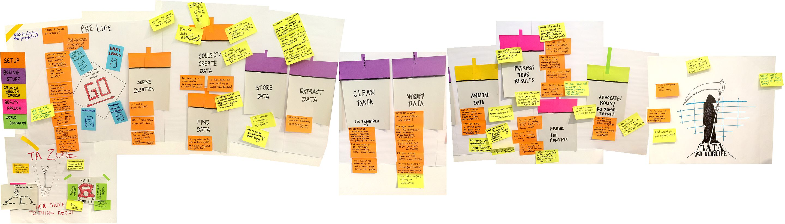

#   DSC 100: Introduction to Data Managment

## Description:

Databases are at the heart of modern commercial application development. Their use extends beyond this to many other environments and domains where large amounts of data must be stored for efficient update, retrieval, and analysis. The purpose of this course is to provide a comprehensive introduction to the use of management systems for applications. Some of the topics covered are the following: data models, query languages, transactions, database design and database as a service.

## Instructional team:

**Instructor:**

[Babak Salimi](https://bsalimi.github.io/), bsalimi@ucsd.edu

**Course Assistants:**

Athavale, Shivani Sandeep, [ssathava@ucsd.edu](mailto:ssathava@ucsd.edu) 

Hu, Ruohan, [r8hu@ucsd.edu](mailto:r8hu@ucsd.edu) 

Patil, Chaitanya Sharadchandra, [cpatil@ucsd.edu](mailto:cpatil@ucsd.edu)

**Lectures**:

The lecture for this class will be ASYNCHRONOUS and discussion sections will be SYNCHRONOUS. 

**Office Hours:**

TBD

**Piazza:** [DSC 100-wi21](https://piazza.com/ucsd/winter2021/dsc100) (Requires access code posted on Canvas)

**Have questions? Please email both Babak Salimi (bsalimi@ucsd.edu) and one of the TAs for questions on logistics. All other questions SHOULD be discussed on Piazza.**

## **Calander:**

**(subject to change)**

| Week |           Description           | Slides | **Assignments / Remarks** | **Optional Reading** |
| :--: | :-----------------------------: | :----: | ----- | --------------- |
|  1   | Intro, Data models, SQL (Basic) |        |       |  |
|  2   |   Join and Aggregates in SQL    |        |       |  |
|  3   |       Relational Algebra        |        |       |  |
|  4   |  Query Execution and Indexes  |        |       |  |
| 5  |        Mid-term        |        |       |  |
|  7   | Conceptual Design |        |       |  |
|  8   |         Size Estimation; NoSQL, JASON         |        |       |  |
|  9   |     JASON and SQL++ |        |       |  |
|  10  |  Transactions |        |       |  |
| 11 | Final-exam | | |  |

## Workload:

**(subject to change)**

**Homeworks (60%):** There will be **weekly homeworks** (due in 7 days). They will be based on the last 1-2 lectures. They are of two types:

1. **Written problem solving and programming assignments (50%):**
   Start early and allocate enough time to solve these problems! 

   **Late policy:** Homework problems that are submitted late will receive an automatic deduction of 5% per hour late (per problem, not per sub-problem, so even if one sub-problem is late, the problem is late). You will receive no credit after the sample solution becomes available. We will drop the (one) lowest score at the end.

2. **Gradiance exercises (10%):**
   [Gradiance](https://www.gradiance.com/) is an online service pioneered by one of the authors of the textbook, Prof. Jeffrey Ullman at Stanford. One of the best features of Gradiance is that you are permitted to test yourself on a particular topic as many times as you like. You receive immediate feedback for each attempt, which avoids the shortcoming of the traditional submit-and-then-wait-for-grades assignments where one error in understanding can permeate solutions to multiple problems and does not get rectified until much later. We encourage you to continue testing on each topic until you complete the part of the assignment with a 100% score. The highest score will be recorded. The questions will be the same in every attempt, but the answer choices will be selected at random. We will drop the lowest two scores at the end.

3. **Midterm (20%)** and **final  (20%)**: Details would be posted later.

4. **Extra Credit**: 

   - Some howmeworks have extra credit questions.

   - Large number of good answers on Piazza.  

## Resources / Communication / Toolkits:

**Book:** Although a textbook is not required in the course, the following textbook is optional and recommended. Lecture slides and recorded videos would be sufficient for this class.

Database Systems: The Complete Book, by Hector Garcia-Molina, Jeffrey D. Ullman, and Jennifer Widom. 2nd Edition. Prentice Hall. 2008.

**Gradescope:** We will use Gradescope (for submission and grading of (non-Gradiance) homeworks and exams.

**Communication and Piazza:**  All important announcements will be sent through both Piazza and Canvas.

All questions that may be of general interest to the class should be directed to Piazza. Do not use the mailing list. You will get your questions answered faster on Piazza than via personal emails to the instructional team, because Piazza is monitored closely by everybody in the class, not just the course staff. You are highly encouraged to answer each others' questions on Piazza ( *you will get extra credit for # of good answers on Piazza!*) and the instructional team would endorse/add to those answers.

## Related Groups:

- [UCSD Database Group](https://dbucsd.github.io/)

- [SIGMOD (Special Interest Group on Management of Data)](https://www.google.com/url?q=https%3A%2F%2Fsigmod.org%2F&sa=D&sntz=1&usg=AFQjCNEv9sM8CpuOZ7oxWFX_20353W6NZw)

- [VLDB (Very Large Data Base Endowment Inc.)](https://www.google.com/url?q=https%3A%2F%2Fwww.vldb.org%2F&sa=D&sntz=1&usg=AFQjCNEN7a3TJIOhpq3OC7bw9DKWHhki-w)

- [PODS (Symposium on Principles of Database Systems)](https://www.google.com/url?q=https%3A%2F%2Fsigmod.org%2Fpods%2F&sa=D&sntz=1&usg=AFQjCNEy52V8Padws9vrgz2GoFYinNgG9Q)

- [ICDT(IEEE International Conference on Data Engineering)](http://ieee-icde.org/)

- [CIDR (Conference on Innovative Data Systems Research)](http://www.google.com/url?q=http%3A%2F%2Fcidrdb.org%2F&sa=D&sntz=1&usg=AFQjCNHZ5MTU545Lei9xcYfQR9fHHLan5w)

  

  

  

  

